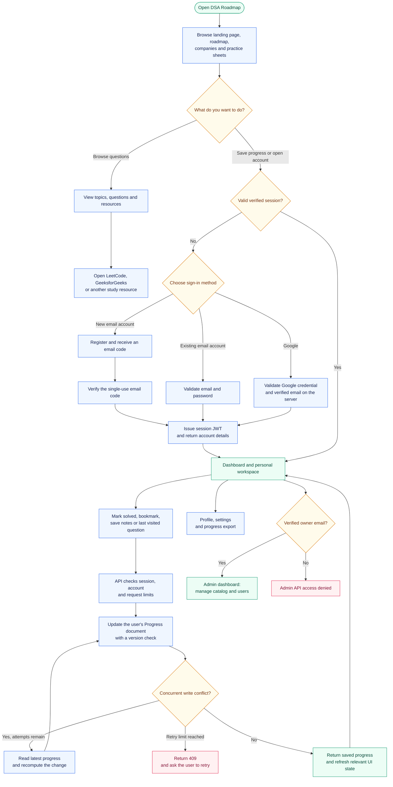

# Application flow

[Back to README](../README.md) · [High-level design](HLD.md) · [Deployment guide](../DEPLOYMENT.md)

Visitors can browse the catalog without signing in. A verified session is required
to save personal progress, use account pages, or open the admin dashboard. This
diagram follows the implemented routes and services.

## What happens behind each step

| Step | Actual behavior |
| --- | --- |
| Public browsing | Optional authentication adds the current user's solved/bookmarked flags. Guests see the catalog without personal progress. |
| Sign-in | Email/password requires an already verified account. Registration verifies an emailed code first. Google credentials are validated server-side. Invalid credentials or codes do not issue a session. |
| Session validation | The browser sends a bearer JWT. The API checks its signature, session purpose, current account, verification state and token version. |
| Practice | External platforms provide the problem or study material. This app does not execute submissions or automatically import LeetCode acceptance results; users mark completion themselves. |
| Progress save | One unique Progress document belongs to each user. Concurrent creation uses an upsert; conflicting saves retry from fresh state, up to five save attempts. Solved IDs, difficulty counters and activity are saved together. |
| UI refresh | Solved/bookmark changes invalidate progress and dashboard caches and emit `progress:updated`. Mounted listeners reload their data. Notes and last-visited updates invalidate the progress cache. This is request/event-driven, not WebSocket synchronization. |
| Roadmap percentages | Topic totals and the user's solved question IDs determine progress. A guest or a user with no solved questions does not receive simulated progress. |
| Admin access | Only the verified `sainkygurjar12@gmail.com` account is authorized. The API enforces this even if a client or another account claims an admin role. |
| Failures | Protected requests without a valid session return 401; forbidden admin access returns 403; exhausted progress retries return 409; rate limits return 429. Authentication database failures return 503. |

Password recovery uses a separate path: request reset code → verify the code →
receive a short-lived, single-use reset token → set a new password → sign in again.
Reset tokens cannot authenticate normal API requests. Password changes and resets
invalidate existing sessions through the account's token version.

## Code references

- [Page routes](../client/src/routes/AppRoutes.jsx) and [API client](../client/src/services/api.js)
- [Authentication](../server/src/services/auth.service.js) and [session checks](../server/src/middleware/auth.middleware.js)
- [Progress service](../server/src/services/progress.service.js) and [conflict handling](../server/src/utils/progressMutation.js)
- [Client progress refresh](../client/src/services/progressService.js) and [landing progress](../client/src/hooks/useLandingProgress.js)
- [Owner policy](../server/src/config/admin.js)
