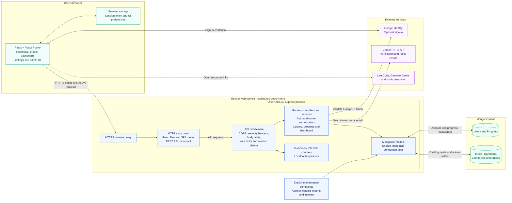

# High-level design

[Back to README](../README.md) · [Application flow](FLOW.md) · [Deployment guide](../DEPLOYMENT.md)

DSA Roadmap is a MERN application with one Express API process and one MongoDB
database. React runs in the user's browser. In the configured production layout,
Express also serves the compiled React files, so the website and `/api` share an
origin. The Render boundary below describes the prepared deployment configuration;
it does not mean a Render service has already been connected or deployed.

Arrows show calls or data access; HTTP responses return along the same request
path. The maintenance commands run separately and reuse the models; they are not
an automatically running service inside the web process. SMTP is also supported
for local development or compatible hosts; the Render Blueprint selects Gmail HTTPS with sender OAuth.

## Responsibilities and data

| Component | Responsibility |
| --- | --- |
| React application | Renders pages, keeps short-lived client caches, sends authenticated API requests and updates visible progress. Browser state is not trusted for authorization. |
| Express API | Validates requests and sessions, restricts admin access, calculates catalog/progress responses and coordinates database writes. Business logic stays on the server. |
| Mongoose connection | Reuses a bounded pool, applies connection/query timeouts and disables indefinite command buffering. The configured default is 20 application connections per process. |
| MongoDB Atlas | Persists the catalog, accounts and progress across application restarts or deployments. |
| Google Identity | Provides an optional identity credential that the server validates before creating a session. |
| Gmail API | Delivers verification and password-reset codes through HTTPS. Sender OAuth credentials stay on the server, separate from user Google sign-in. |

| Collection | Main relationships |
| --- | --- |
| User | Unique email; identity, verification, password/reset state and session version. |
| Progress | Unique reference to one User; solved/bookmarked Question IDs, notes, activity, streak and last visited Question. |
| Question | References one Topic and zero or more Companies and Sheets; contains practice/study URLs and metadata. |
| Topic | Groups questions for the roadmap and topic statistics. |
| Company | Groups questions for company-specific preparation. |
| Sheet | Stores sheet metadata and, for curated sheets, ordered entries referencing Questions. Repeated entries can share a Question and its progress. |

Catalog imports are explicit, additive maintenance operations. They reuse existing
question identities and preserve progress. They do not scrape external platforms
for every page request or run automatically at application startup.

## Build and deployment path

1. Developers push a branch or open a pull request. GitHub Actions runs lint,
   frontend build, browser tests, server tests, isolated MongoDB concurrency tests,
   dependency audits and a Docker build.
2. When checks pass on `main`, a connected Render service configured with
   `autoDeployTrigger: checksPass` builds the repository's Dockerfile.
3. The Docker build compiles React and packages it with the API. Runtime uses an
   unprivileged user; environment files are excluded from the build context.
4. Startup validates configuration and waits for MongoDB before accepting traffic.
   `/api/health` reports 200 while MongoDB is connected and 503 otherwise.
5. Render uses that readiness endpoint before routing traffic to a new deployment.
   The old process drains requests on shutdown. Database changes must remain
   compatible with both versions during the transition.

See [the workflow](../.github/workflows/ci.yml), [Dockerfile](../Dockerfile),
[Render Blueprint](../render.yaml) and [deployment guide](../DEPLOYMENT.md) for
the actual configuration and activation steps.

## Reliability boundaries

- The design currently targets one API process. Rate-limit state is in memory;
  it resets on restart and is not shared across replicas or deployment overlap.
- Progress writes use optimistic version checks with bounded retries. This avoids
  silently overwriting concurrent changes; it does not guarantee every request
  succeeds during database/network failures.
- Health checks establish database connectivity, not complete end-to-end health.
  Email delivery, sign-in and progress saving need deployed smoke checks.
- Free-host sleep, quotas and resource limits remain relevant. A 20-connection
  pool does not mean a limit of 20 users, and it does not prove 200-user capacity.
  Measure realistic traffic on the deployed service before promising capacity.
- Backups and restore tests are operational tasks outside this web process.
  A code rollback cannot undo a database migration. See the deployment guide for
  Atlas tier considerations and backup instructions.
- Future horizontal scaling needs a shared rate-limit store and measured database
  capacity. There is currently no Redis, queue worker, WebSocket service or
  automatic LeetCode submission synchronization in this implementation.

## Code references

- [HTTP application](../server/src/app.js) and [startup/shutdown](../server/src/server.js)
- [Database connection](../server/src/config/db.js) and [models](../server/src/models)
- [Session middleware](../server/src/middleware/auth.middleware.js), [owner policy](../server/src/config/admin.js) and [rate limits](../server/src/middleware/rateLimits.js)
- [Progress writes](../server/src/utils/progressMutation.js) and [email provider](../server/src/utils/sendEmail.js)
